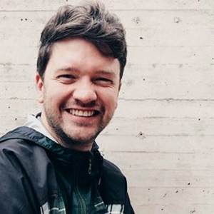
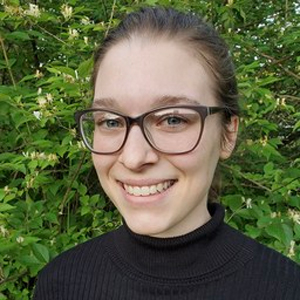
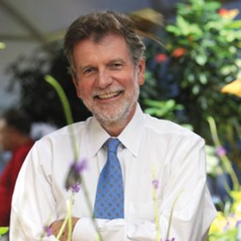
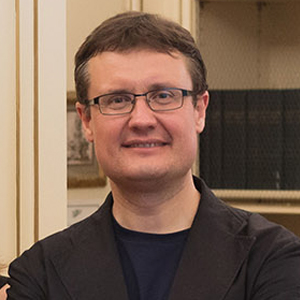

<param ve-config 
       title="Plant Humanities Lab"
       layout="index">

# Essay Contributors

##
**Thomas C. Anderson**

Anderson’s research, which draws upon both historical archival studies as well as plant biology and botany, explores how early modern colonial encounters with the natural world helped shape our modern pharmacopoeia. To the early modern naturalist and explorer, the keys to life’s greatest mysteries were to be found in the petals, leaves, and anthers of strange and exotic plants. Amerindian horticultural, botanical, and art-historical contributions to this complicated and multifaceted story have only recently emerged as a subject of scholarly interest. Anderson uses the history of medicine and botany to help elucidate the unknown pasts that have nonetheless had a major impact on the construction of scientific and medical knowledge up to today. Anderson is a master’s candidate at Columbia University. He holds a bachelor’s in history and French and Francophone Studies from Hamilton College. Anderson has explored transoceanic acclimatization and the indigenous Guanche pharmacopoeia in the Canary Islands; the early modern history of imperial science and medicine in Paris; ethnobotany and plant taxonomy at the New York Botanical Gardens; historical manuscripts concerning colonial plants and their uses at the John Carter Brown Library; and toxicity and plant defense systems at Cornell University. 

##
**Yota Batsaki**

Yota Batsaki is the executive director of Dumbarton Oaks, a Harvard research institute, museum, and historic garden located in Washington, D.C. She holds a Ph.D. in comparative literature from Harvard University and was previously a lecturer and fellow at St. John’s College, Cambridge. Batsaki contributes to the research agenda of Dumbarton Oaks as principal investigator of the Plant Humanities Initiative. Funded by the Andrew W. Mellon Foundation, this is a four-year initiative to advance the emerging field of plant humanities in close dialogue with the environmental humanities and with a focus on plant-human interactions. Batsaki leads a collaboration with JSTOR Labs to develop an open access digital platform that will highlight primary sources about plants and connect them to large databases such as Global Plants and the Biodiversity Heritage Library. She also oversees scholarly programming that brings together intergenerational teams of students and researchers to investigate and narrate important cultural histories of plants for the digital platform under development.

##
**Camilo Uribe Botta**

Uribe Botta’s current PhD research explores the orchid trade between Colombia and the United Kingdom in the nineteenth century, focusing on the global connections created around the plants in both sides of the Atlantic. His research analyzes the networks around these plants, from their hunting in the Colombian jungles to their conservation in British Botanical Gardens or collections from wealthy British collectors. Its overall aim is to chart the economic, scientific, and cultural conditions that led to the success of tropical orchids as a scientific and a commodity object. He focuses on the agency of orchids in global history and their relationship with humans in the nineteenth-century commerce. Botta is a PhD candidate in history at the University of Warwick. He holds a bachelor’s and a master’s in history from Universidad de los Andes in Bogota, Colombia. Uribe Botta has been assistant curator and registrar and collections manager of the Museo Colonial and Museo Santa Clara, two public institutions that are part of the Ministry of Culture of Colombia. He participated in the overhaul and total renovation of the museum’s exhibitions between 2013 and 2019. He has been a history consultant for different cultural projects in museums, theaters, and television, including the Canoas Archeological Park in Soacha, the Teatro Colón de Bogotá, and Bolívar from Caracol TV and Netflix.

##
**Ashley Buchanan**

Ashley Buchanan is the Postdoctoral Fellow for the Plant Humanities Initiative at Dumbarton Oaks. She is a historian of the early modern world, with a particular interest in plants, recipes, and medicinal cultures in 17th- and 18th-century Europe. She received her PhD in early modern history from the University of South Florida in 2018. Her research spans many topics which includes the history of science and medicine, women, and politics as well as the dynamics of gender and authority. Her current book project investigates the social, cultural, and political significance of pharmaceutical experimentation as well as the medicinal and botanical patronage at the late Medici Court (1650-1743). Her goal is to broaden the global dimension of recipes by studying the numerous exotic plants imported into Tuscany from the New World, East Africa, and Southeast Asia in the late 18th century. Ashley was a junior fellow in residence with the Medici Archive Project at the Archivio di Stato di Firenze and an Andrew W. Mellon Foundation Fellow at The Huntington.

##
**Verónica Marallana Chaves**

Matallana Chaves’s undergraduate thesis research focuses on the history of textile work in Colombia and the use of natural fibers with a botanical-historical approach. Given the country’s sociocultural diversity, material cultural objects with an artisan trajectory play a key role in the consolidation of identities and symbolic networks. Although these objects have a consolidated historical trajectory, their agency has been changing as they have been touched by the dynamics of conservation, commodification, and resignification. Her work brings these points of tension and breakdowns in craft traditions to the surface. Chaves is in her third year of the undergraduate program in history at the Universidad Nacional de Colombia, where she has participated in projects on digital history, environmental history, and oral history and memory. She is currently part of the Public and Digital History group and is linked to the Laboratory of Historical Cartography and Digital History.

##
**Christina Emery**

Christina Emery is a senior undergraduate student majoring in archaeology and anthropology with a minor in history at the University of Cincinnati. She is pursuing certificates in Geographic Information Sciences, Mediterranean archaeology, and European Studies. Emery has archaeological field experience excavating a Fremont culture site in Boulder, Utah. She has also created multiple digital museum displays which revolve around the intersection of nature and science through medical discoveries from various cultures. Emery has conducted research into the ecology of and human interaction with the common dandelion, Taraxacum officinale. She has also conducted independent research into the influence that colonialism has had on the modern city of London. Her research interests currently consist of the changing relationships that people have with plants and the natural world.

##
**Julia Fine**

Julia Fine is a graduate student at the University of Cambridge studying Modern South Asian Studies as a George Kingsley Roth and Cambridge Trust Scholar. She received her A.B. from Harvard University in History & Literature. In 2019, Julia was a fellow at the Folger Shakespeare Library, where she worked on the Mellon-funded “Before ‘Farm to Table’: Early Modern Foodways and Cultures“ project. In 2020, she joined the Plant Humanities Initiative at Dumbarton Oaks, where she explored the movement of plants through the lens of imperial ambitions specifically within the context of the Indian Ocean world.

##
**Rebecca Friedel**

Rebecca Friedel focuses on the cultural histories of plants from the Americas as a Plant Humanities Research Associate with Dumbarton Oaks. Friedel is also a paleoethnobotanist and PhD candidate in Anthropology at the University of Texas at San Antonio. Her doctoral research takes an interdisciplinary approach to reconstructing ancient Maya human-plant relationships. She is currently a U.S. Fulbright Scholar at the University of Belize where she is teaching under and establishing a BA program in Anthropology. She is passionate about education and improving access to knowledge more broadly, having co-founded an educational outreach 501c3 organization, Heritage Education Network Belize.

##
**Kristan M. Hanson**

Kristan M. Hanson is a Plant Humanities Fellow at Dumbarton Oaks. She is an art historian of nineteenth-century France, with a particular focus on depictions of women, ornamental plants, and spaces of horticultural labor and leisure. She received her PhD in art history from the University of Kansas in 2020. Her research interests include visual portrayals of plants and human-plant interactions; cultural associations of flowers and floral imagery with social markers of difference; horticultural trade networks, colonialism, and intimacy; and artistic engagements with environmental issues. Her dissertation applied digital humanities methods and tools to the study of horticultural art, plant mobility, and gendered spatial practices in the context of 1870s Paris. She has received fellowships and awards from the Oak Spring Garden Foundation, HASTAC Scholars program, and the Hall Center for the Humanities. Most recently, she coedited the exhibition catalogue Perspectives on a Legacy Collection: Sallie Casey Thayer’s Gift to the University of Kansas (2020).

##
**Yao Jiang**

Jiang’s research explores the reinterpretation and reintroduction of the Chinese garden into modern discourse as a critical instrument to document China’s continuous cultural traditions. He is interested in the construction material exchanges and flows of the Chinese garden and its social and cultural relations, especially the introduction and cultivation of Chinese plants into the United States in the late twentieth century. For his thesis, Jiang is focusing on how the Astor Chinese Garden Court in the Metropolitan Museum of Art reshaped America’s understanding of the Chinese garden using several lenses, including the field of plant humanities. Jiang is a master student in architectural history at the University of Virginia. He holds a Bachelor of Art in environmental design from Tongji University. Jiang has served as the teaching assistant for the Sustainability Consciousness course at Tongji University (fall 2018) and the Metropolis course at UVA (spring 2020). He has recently been selected as a 2020 recipient of the Student Research Grant from the School of Architecture for his thesis project. Jiang is currently a part-time daily translator and editor to the ArchDaily China platform and serves as a research assistant to Andrew Johnston for his book project on preservation practice in China.

##
**Cati Kalinoski**

Kalinoski’s research examines plant-life exhibition work through the lens of performance to investigate theories of time, extinction, and the natural world. Her research is grounded on what we as humans can learn from plants and how they shape humans’ positions in the world. Taking from disciplines such as performance studies, anthropology, museum studies, environmental studies, and philosophy, Kalinoski’s work images a new form of politics around the lessons learned from nature. Kalinoski is a master candidate at New York University’s Tisch School of the Arts Performance Studies program and a theater practitioner. Her work is centered on plant studies and theories extinction through the lens of performance and exploring new notions of time in the Anthropocene. She has been awarded the Artist and Scholar Award for her research and has presented her work across the United States

##
**Wouter Klein**

Wouter Klein is Plant Humanities fellow at Dumbarton Oaks. A historian from the Netherlands, he received his PhD from Utrecht University in 2018. He is interested in the interconnected history of medicine, pharmacy, and botany in the early modern period; the circulation of knowledge and commodification processes of therapeutic drugs; and digital research methods to study medical practices of the past over the long term. He has a particular interest in the availability of materia medica in the past, either as commercial goods in trade records, research specimens for academic physicians, or commodified products for the general public. His research aims to unravel the question of how the global dimensions of commerce, science, and society helped some non-European natural substances become major commercial ingredients for medicines while others had much less success in the early modern medical marketplace. To tell those stories, his research makes use of large collections of digital historical data, like private correspondence, pharmaceutical manuals, auction records, and newspaper advertisements.

##
**W. John Kress**

W. John Kress is Distinguished Scientist and Curator Emeritus at the Smithsonian’s National Museum of Natural History and co-chair of the Earth BioGenome Project. He was curator of botany for over thirty years and formerly served as the interim undersecretary for science at the Smithsonian and director of science in the Grand Challenges Consortia. Kress received his B.A. from Harvard University and Ph.D. from Duke University, where he studied tropical biology, ethnobotany, evolution, and ecology. He is a taxonomic specialist on the tropical Zingiberales, and his current research is focused on biodiversity genomics, conservation, and the Anthropocene. Among his more than 200 scientific and popular publications are his books Plant Conservation: A Natural History Approach, The Weeping Goldsmith, The Art of Plant Evolution, and The Ornaments of Life: Coevolution and Conservation in the Tropics. His most recent book isLiving in the Anthropocene: Earth in the Age of Humans. He is a fellow of the American Association for the Advancement of Science and is currently visiting scholar at Dartmouth College and the Arnold Arboretum of Harvard University. He lives in Dorset, Vermont.

##
**Anna Lawrence**

Lawrence’s research explores the sociopolitical lives of flowers in Victorian Britain, considering the different plant-human relations at play in the commodification of cut-flowers, botanical instruction for women and girls, domestic working-class floriculture, and settler colonial horticulture. Grounded theoretically in critical plant studies, Lawrence is interested in the material intimacies at play in these different spheres of plant-human interaction and how they were thought about at the time, seeking to illuminate a world of alternative and exaggerated sensibilities between people and plants to help us question our own approaches to plant nature today. Lawrence is a PhD student in the Department of Geography at the University of Cambridge where she also undertook her undergraduate and master’s degrees. She is a cultural and historical geographer interested in plant-human relations. In addition to Victorian floriculture, she has worked on weeds and urban nature, as well as Caribbean music and culture in the United Kingdom. Anna currently co-convenes the graduate student-led research group Vegetal Epistemologies in Cambridge.

##
**Lucas Mertehikian**

Mertehikian’s research offers a new lens on how to look at Latin American identity and its cultural and political relation with the United States with a focus on collecting efforts carried out by American scientists, diplomats, and scholars from the 1840s to the 1970s. Specifically, he analyzes three collections as case studies: Harvard University’s Latin American botanical collection, Dumbarton Oaks’ Pre-Columbian art collection, and Princeton University’s Latin American literary manuscripts collection. His current work examines how American botanist Asa Gray first took an interest in Latin American nature in the nineteenth century and the political implications that informed his collection of Latin American specimens. Mertehikian is a PhD candidate in Romance languages and literatures at Harvard University. He holds a licenciatura in literature from the Universidad de Buenos Aires and a master’s in Latin American Studies from the Universidad Nacional de Tres de Febrero, both in Argentina. In 2018, he cocurated the exhibition Passports: Lives in Transit at Houghton Library, which featured in the Boston Globe, the Harvard Gazette, and the Armenian Spectator, among other publications.

##
**Victoria Pickering**

Dr. Victoria Pickering is a Research Associate in the Plant Humanities Initiative, having been a Research Fellow at Dumbarton Oaks  between 2019-2020. Previously, she researched the global movement of plants from the late seventeenth century onward at the British Museum and the Natural History Museum in London. Today, she continues to explore the collection, description, management, and use of natural history objects in the early modern period.

##
**Daisy Reid**

Daisy Reid is a graduate student in comparative literature at the University of Southern California, with a research focus on contemporary speculative and ecological fictions in conversation with critical race, queer, and feminist theory. She holds a BA in French and Italian from University College London and an MA in comparative literature from the University of Amsterdam. Her current work explores literary and artistic representations of plant-being as they come to bear upon (bio)political structures surrounding gender, sexuality, erotics, and desire.

##
**Melinda Susanto**

Susanto’s research investigates the practices of health and medicine in eighteenth-century Indonesia through the records of the Dutch East India Company. She is focusing on the utility of plants and indigenous knowledge from the archipelago, particularly the role of local intermediaries in facilitating European knowledge production of the region. Susanto is a PhD candidate in history at Leiden University. She recently completed an MA in colonial and global history at Leiden University in 2019. Prior to this, she worked as an assistant curator at the National Gallery Singapore between 2014 and 2018. Her previous projects have explored visual materials reflecting interactions between Europe and Southeast Asia, including works on paper and books produced as a result of European scientific explorations of the region. Susanto also holds an MA in the history of art from the Courtauld Institute of Art and a BA in art history and Ancient Greek from the Australian National University.

##
**Anatole Tchikine**

Anatole Tchikine is curator of rare books at Dumbarton Oaks. An architectural historian and a specialist on early modern Italy, he holds a PhD from the University of Dublin, Trinity College. His work mainly addresses the intersections of art and science, including the history of fountain design, botanical gardens, and collecting and representations of nature. He is the author, with Pierre de la Ruffinière du Prey, of _“Discrizione della Villa Pliniana”: Reimagining Antiquity in the Landscape of Umbria_ (2021), editor of _The Three Natures: Gardens and Landscapes of the Italian Renaissance_ (forthcoming), and coeditor of _The Botany of Empire in the Long Eighteenth Century_ (2016) and Military Landscapes (2021).

##
**May Wang**

May Wang graduated from Harvard College in 2020 with a degree in comparative literature and a secondary in astrophysics. Her undergraduate work often focused on the intersection of cultural and scientific history, especially in nineteenth-century novels. Wang has interned at the Harvard Art Museums, Dumbarton Oaks, and the Smithsonian Astrophysical Observatory. Wang is currently a Postgraduate Writing and Reporting Fellow at Dumabrton Oaks.
